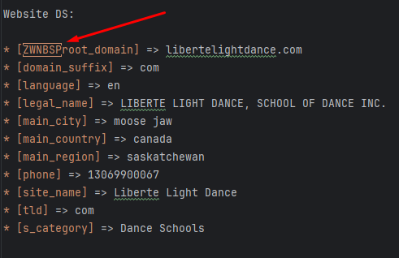

# Joiny
### An attempt to get a job :-)
Welcome to my demo project applying for a job at 
<a href="https://soleadify.notion.site/Deeptech-Engineer-Intern-Challenges-b5d4791a26e94979a6abccb62209cf14">Veridion</a>.
My choice for today is the 3rd challenge: <b>Datasets join</b>
___
<b>Challenge #3</b> 
<b>Datasets join</b>

The input for this challenge is an archive 
(download [here](https://drive.google.com/file/d/1jF7lnMUffCX8U252MoY7jowb7VedFOp8/view?usp=sharing)) 
containing 3 datasets with data about the same companies from 3 different sources: 
1. **Facebook** (facebook dataset.csv)
2. **Google** (google dataset.csv)
3. **Company Website** (website dataset.csv)

The final purpose of this exercise is to create a 4th dataset that contains the other 
3 and, by joining them, we should reach a better accuracy on common columns.

The columns that interest us the most are Category, Address (country, region...), Phone, Company names.
___
## Finding a solution

Step 1 is to observe the data. Here i'm looking for several things:
- What's the magnitude we are working at? How many rows? How many columns? How many sets of data?
- Is there any guarantee about the data? Any rule we can use to optimize the proccess later?
- How "unique" is the data? Do we have entries related to the same entity in the same data aset? How about different data sets?
- Finally, what parameters can we define about any one entity? Do duplicate entries have conflicting parameters? How do we solve conflicts?
__________
- 
First sight, opened the csvs in Excel. 
Looking at the data in tabular form, 
I notice fast something important: 
Data is not complete. Fields for some entities 
are empty seem to not make sense. 

Second, I notice that each entity appears to represent a company. 

Thirdly, after openeing the csvs with a text editor, looking at the
row count, I find:
- Google DS:   356521
- Facebook DS:  72081
- Website DS :  72019

So it's safe to conclude there is no easy 1 to 1 connection between data sets.

Let's analyze given parameters in each dataset with examples:

Google DS

* [address] => 1800 Orleans St, Baltimore, MD 21287
* [category] => Clinics - Surgeons & Physicians
* [city] => baltimore
* [country_code] =>
* [country_name] => united states
* [name] => The Johns Hopkins Hospital Emergency Room
* [phone] => +14109555000
* [phone_country_code] =>
* [raw_address] => Baltimore, MD · (410) 955-5000
* [raw_phone] => (410) 955-5000
* [region_code] => md
* [region_name] => maryland
* [text] => Emergency room Baltimore, MD · (410) 955-5000 Open 24 hours
* [zip_code] => 21287
* [domain] => hopkinsmedicine.org

Facebook DS

* [domain] => downeastcoffee.ca
* [address] => 3935, route nb-115, e4v 2g1, notre dame, nb, canada, new brunswick
* [categories] => Coffee & Tea Shops
* [city] =>
* [country_code] => ca
* [country_name] =>
* [description] => We are dedicated to consistent small-batch roasting and blending of extraordinary coffees for wholesale, retail, mail order and private labelling! Additional Information Welcome to Down East Coffee R  oasters! Since 1996, we have been dedicated to consistent small batch roasting and blending of shade grown, organic, Fair Trade and other extraordinary coffees for wholesale, retail, mail order and private labeling.
* [email] => roasters@bellaliant.com
* [link] => http://downeastcoffee.ca
* [name] => Down East Coffee
* [page_type] => LocalBusiness
* [phone] => +15065769292
* [phone_country_code] => ca
* [region_code] =>
* [region_name] =>
* [zip_code] =>

Website DS

* [root_domain] => libertelightdance.com
* [domain_suffix] => com
* [language] => en
* [legal_name] => LIBERTE LIGHT DANCE, SCHOOL OF DANCE INC.
* [main_city] => moose jaw
* [main_country] => canada
* [main_region] => saskatchewan
* [phone] => 13069900067
* [site_name] => Liberte Light Dance
* [tld] => com
* [s_category] => Dance Schools

_While making this list I noticed Website DS has some kind of unicode character before 'root_domain', which I will fix for later:_

---

Let's organize it everything as a table (click to expand)

| Google DS          | Facebook DS        | Website DS    | Description                                                                  |
|--------------------|--------------------|---------------|------------------------------------------------------------------------------|
| name               | name               | site_name     | Title of entity `ABC Investment`                                             |
| category           | categories         | s_category    | Domain of activity `Business Analysis`                                       |
|                    |                    | legal_name    | Legal name of entity `ABC Investment Inc.`                                   |
|                    | description        |               | Relative long string describing company `Lorem ipsum...`                     |
|                    |                    | language      | ISO-639 2 letter language code `ro`                                          |
| address            | address            |               | String of complete address `123 Main St, [City], [Region], [Country], [ZIP]` |
| zip_code           | zip_code           |               | Address zip code `t2a 6j4` / `061095`                                        |
| city               | city               | main_city     | Entity city `Bucharest`                                                      |
| country_name       | country_name       | main_country  | Entity country `Romania`                                                     |
| country_code       | country_code       |               | ISO-3166 alpha-2 country code `ro`                                           |
| region_name        | region_name        | main_region   | Entity region `Ilfov`                                                        |
| region_code        | region_code        |               | Short code for region_name, maybe check NUTS/Eurostat?  `IF`                 |
| phone              | phone              | phone         | International phone no. `+40712123123`                                       |
| raw_phone          |                    |               | Google DS specific - pretty phone no? doesnt include prefix`(419) 893-8206`  |
| phone_country_code | phone_country_code |               | ISO-3166 alpha-2 country code `ro` - referring to phone prefix               |
|                    | email              |               | Email address `contact@example.com`                                          |
| domain             | domain             | root_domain   | Web adress `example.com`                                                     |
|                    | link               |               | URL including protocol (useable as anchor) `http://example.com.au/`          |
|                    |                    | tld           | Top-Level Domain `au`                                                        |
|                    |                    | domain_suffix | Web adress ending `com.au`                                                   |
|                    |                    |               |                                                                              |
|                    |                    |               |                                                                              |
| text               |                    |               | Google DS specific - appears to be gMaps status of location                  |
|                    | page_type          |               | Facebook DS classification of facebook page type `LocalBusiness`             |

Looking at the table, we can probably assume it would be easiest to match 
entities between different data sets on common parameters between all sets.
That is: _name, category, city, country, region, phone, website_. Of course,
we should not blindly match them based on equality, as, for example, 2 different
businesses could be located in the same cities, but be distinct none the less.

Taking all this into consideration, I think we should split the parameters into 2 types:
- Decisive - parameters that uniquely identify an entity (like `name`)
- Guiding - parameters that could only guide the decision (like `city` - if we compare 2 entities we 2 different cities, we could perhaps counclude they are different, but the reverse is not true)

Looking at the data, we have to take into consideration one more factor, before starting to develop a solution:
There are duplicate entries withing the same data set. So it's imperative to first identify these and set relationships
and unique identifiers. For this purpose we will use the same principle of decisive and guiding parameters, but in this
case they don't have to be common between datasets, but specific to the data set.

